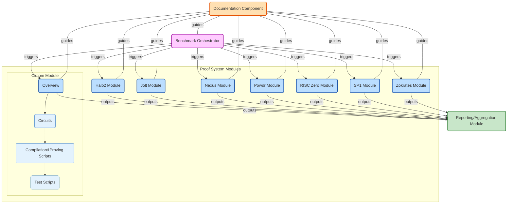

# ZK Benchmark

## Overview

This repository hosts the source code and resources for benchmarking various Zero-Knowledge (ZK) proofs. It builds upon the original repositories of Halo2, RISC0, Nexus, SP1, Jolt, Circom, and Powdr with our implementations of proofs including but not limited to SHA256, Fibonacci, and Poseidon operations.

Our aim is to benchmark the performance of these proofs, comparing them in terms of time, space, and other metrics. This comprehensive comparison will not only highlight the most popular ZK proofs and their implementations but also deepen our understanding of their inner workings, developer friendliness, and proving systems.

## Goals

- **Benchmark Operations:**
  - **Fibonacci:** Variants 1, 10, 100, 1000, 10000
  - **SHA256:** Variants 32b, 1k, 10k Bytes
  - **Poseidon:** Variants 32b, 100b

- **Additional Benchmarks:**
  - Arithmetic Operations: Addition, Subtraction, Multiplication, Division
  - Loop: Variants 10, 100, 1000
  - Hash Functions: Pederson, RPO, Keccak (Variants 1k, 10k Bytes)
  - Merkle Tree: Generation, Membership/Inclusion, Merge
  - nth Prime: Variants 1, 10, 100, 1000, 10000
  - Cryptographic Verifications: ECDSA, Elliptic Curve, BLS Verification, BLS Aggregation

## Proving Schemes

| Name | Type | Benchmark Code | Reports |
|--------------|------|-------------|-----------|
| [Jolt](https://jolt.a16zcrypto.com)    | zkVM | [code](./jolt/)    | [report](./reports/jolt/)    |
| [Powdr](https://docs.powdr.org/)       | zkVM | [code](./powdr/)   | [report](./reports/powdr/)   |
| [Circom](https://docs.circom.io)       | HDL | [code](./circom/) |  [report](./reports/circom/Results_circom.txt) |
| [Nexus](https://docs.nexus.xyz)        | zkVM | [code](./nexus/) | [report](./reports/nexus/)   |
| [Halo2](https://zcash.github.io/halo2) | Proof System | [code](https://github.com/babybear-labs/halo2/tree/ba4d9c55c88091a7732478042eb548943a63e056) | [report](./reports/halo2/)   |
| [Risc Zero](https://dev.risczero.com/api) | zkVM | [code](./risc-zero/) | [report](./risc-zero/benchmarks/risc-zero.json) |
| [SP1](https://docs.succinct.xyz/docs/sp1/introduction) | zkVM | [code](./sp1/)     | [report](./reports/sp1/) |
| [Polygon Miden](https://0xpolygonmiden.github.io/miden-vm/intro/main.html) | zkVM | TBA       | TBA       |
| [Aleo SnarkVM](https://github.com/ProvableHQ/snarkVM) | zkVM | TBA       | TBA       |
| [Zokrates](https://zokrates.github.io) | DSL | TBA                          | TBA                          |
| [Delphinus Lab ZKWASM](https://github.com/DelphinusLab/zkWasm) | zkVM | TBA       | TBA       |
| [Lita Valida](https://lita.gitbook.io) | zkVM | TBA                          | TBA                          |
| [Eigen ZKVM](https://github.com/0xEigenLabs/eigen-zkvm) | zkVM | TBA                          | TBA                          |
| [CairoVM](https://github.com/starkware-libs) | zkVM | TBA                  | TBA                          |
| [Noir](https://noir-lang.org/docs) | DSL | TBA                  | TBA                          |
| [Ola VM](https://github.com/Sin7Y/olavm) | zkVM | TBA                  | TBA                          |
| [Triton VM](https://triton-vm.org/spec) | zkVM | TBA                  | TBA                          |
| [Lurk](https://docs.argument.xyz) | zkVM | TBA                  | TBA                          |
| [Ceno](https://github.com/scroll-tech/ceno) | zkVM | TBA                  | TBA                          |
| [Expander](https://expander.polyhedra.network) | zkVM | TBA                  | TBA                          |
| [OpenVM](https://book.openvm.dev) | zkVM | TBA                  | TBA                          |
| [Brevis Pico](https://pico-docs.brevis.network) | zkVM | TBA                  | TBA                          |

---
- **zkVM**: Zero-Knowledge Virtual Machine, a virtual machine designed to execute programs written in standard programming languages while generating zero-knowledge proofs of their correctness.
- **HDL**: Hardware Description Language, used for circuit descriptions.  
- **DSL**: Domain-Specific Language, designed specifically for writing ZKP programs.
- **Proof System**: Framework for creating and verifying zk-proofs  
- **TBA**: To Be Added

## **Result Summary** 

Only selected operations are shown. The detailed [reports](./reports/) have metrics for other variants and additional operations.

### Fibonacci
> 10000 th number
<!---

-->

| Proof System           | Prover Time (s) | Cycles  | Verifier Time (s) | Prover Memory (KB) | Proof Size (B)        |
|------------------------|-----------------|---------|-------------------|---------------------|--------------------|
| Halo2                  | 0.196           | -       | 0.004             | 9.8                 | 1664               |
| Circom                 | 1.75            | 9999    | 0.81              | 466280              | 805                |
| Risc Zero              | 6.37            | 65536   | -                 | -                   | 206182             |
| Jolt                   | 21.73           | 280287  | 0.01              | -                   | 452398             |
| Nexus (max 100)        | 35.2            | -       | 2.4               | -                   | 47.9 MB            |
| SP1                    | 18.87           | 69101   | 0.174             | -                   | 2656912            |
| Powdr                  | 8.64            | 2990    | -                 | -                   | -                  |

### SHA256 
> 1 KB Input
<!---

-->

| Proof System           | Prover Time (s) | Cycles  | Verifier Time (s) | Prover Memory (KB) | Proof Size (B)     |
|------------------------|-----------------|---------|-------------------|---------------------|--------------------|
| Halo2                  | 14.78           | -       | 0.13              | 1134                | 4064               |
| Circom                 | 46.07           | 540736  | 1.14              | 3920848             | 805                |
| Risc Zero              | 2.5             | 65536   | -                 | -                   | 210157             |
| Jolt                   | 2.199           | 62231   | 0.052             | -                   | 401116             |
| Nexus                  | 30+ mins        | -       | -                 | -                   | -                  |
| SP1                    | 17.6            | 71249   | 0.172             | -                   | 265691             |
| Powdr                  | 9.07            | 73731   | -                 | -                   | -                  |

### Poseidon 
> 32 Byte input
<!---

-->

| Proof System | Prover Time (s)|     Cycles        | Verifier Time (s) | Prover Memory (KB) | Proof Size (B) |
|-------------|-----------------|-------------------|-------------------|----------------|---------------|
| Halo2       |       8.74      |      -            |      0.086        |       25       |      2144     | 
| Circom      |       1.19      |     4184          |      0.72         |     373560     |       804     | 
| Risc Zero   |       5.47      |     524288        |        -          |       -        |      256742   |
| Jolt        |       91.38     |     554595        |       0.19        |       -        |     477746    |
| SP1         |       112.5     |      39479        |      0.509        |       -        |     2876912   |
| Powdr       |       21.54     |     286652        |       -           |       -        |       -       |

Additional reports in progress.

## General overview of features of proving schemes
<!------>

| Proof System | Setup Complexity | Post-Quantum Resistance | Scalability | Parallel Execution | Features |
|--------------|-------------------|-----------|-------------------------|-------------|-------------------|
|     [**Halo2**](https://zcash.github.io/halo2)   |   Transparent  |      No (ECC based)    |     High    |     Moderate     |  Recursive SNARKs, Custom gates, Plonkish arithmetization    |
|   [**Circom (Groth16)**](https://docs.circom.io)   |  Trusted Setup     |     No (Pairing-based)  |   Moderate  |       High      | Efficient SNARK generation for circuits, good for small proof   | 
|   [**Risc Zero**](https://dev.risczero.com/api)  |   Transparent   |         Yes       |     High    |       High      |  General-purpose zkVM, RISC-V architecture, supports arbitrary computations (STARK + AIR + FRI + RISC V)  |
|     [**Jolt**](https://jolt.a16zcrypto.com)     |   Both          |       Yes       |   Very High |     Very High   |  Sumcheck and lookup arguments, optimized for high-performance proof generation, upcoming [twist and shout](https://eprint.iacr.org/2025/105.pdf)  ( Spartan Sumcheck + R1CS + Zero morph + RISC V )  |
|  [**Nexus zkVM**](https://docs.nexus.xyz)   |   Transparent   |       Partial     |   Moderate  |       High      | Privacy-focused zkVM, Ethereum compatibility, supports smart contract verification	  (R1CS + Relazxed R1CS + Nova + Hyper Nova + Risetto255 + RISC V )  | 
|     [**SP1**](https://docs.succinct.xyz/docs/sp1/introduction)      |   Transparent   |         Yes       |   Very High |     Very High   | Optimized for rollups, efficient parallel proving, GPU-optimised, supports high-throughput applications, supports arbitrary computations, [whitepaper](https://www.provewith.us). ZK: Plonky3 (STARK + AIR + FRI + RISC V), Multi set hashing  |
|    [**Powdr** ](https://docs.powdr.org/)    |   Transparent   |         Yes       |     High    |       High      |  Developer-friendly, multiple proof systems, and zk-continuations for unbounded execution, minimal setup   |
| [**Polygon Miden**](https://0xpolygonmiden.github.io/miden-vm/intro/main.html)    | Transparent            | Yes                     | High        | High                | STARK-based (Winterfell) zkVM, designed for program execution proofs, high scalability|
| [**Aleo SnarkVM**](https://github.com/ProvableHQ/snarkVM)    | Trusted Setup          | No (Pairing-based)      | Moderate    | High                | Privacy-preserving SNARK-based zkVM, supports private smart contracts    |
| [**Zokrates**](https://zokrates.github.io)         | Trusted Setup          | No (Pairing-based)      | Moderate    | High                | High-level DSL for zk-SNARKs, extensive developer tooling, supports Groth16 and PLONK     |
| [**Delphinus ZKWASM**](https://github.com/DelphinusLab/zkWasm) | Transparent            | Yes                     | High        | High                | WebAssembly-based zkVM, supports proving WASM execution, ideal for cross-platform apps    |
| [**Lita Valida**](https://lita.gitbook.io)     | Transparent            | Yes                     | Moderate    | Moderate            | Modular chip, ensures the correctness of zk circuits, supports custom proofs (STARK + AIR + FRI + LITA ISA) |
| [**Eigen ZKVM**](https://github.com/0xEigenLabs/eigen-zkvm)      | Transparent            | Yes                     | Very High   | High                | High-performance zkVM, designed for Ethereum scaling, supports recursive proofs           |
| [**CairoVM**](https://github.com/starkware-libs)         | Transparent            | Yes                     | Very High   | High                | STARK-based VM, designed for StarkNet, supports general-purpose computation               |
| [**Noir** ](https://noir-lang.org/docs)            | Transparent            | Yes (STARK-based)       | High        | High                | High-level zkDSL, supports general-purpose zk circuits, STARK-based backend               |
| [**Ola VM**](https://github.com/Sin7Y/olavm)           | Transparent            | Yes                     | High        | High                | STARK-based, Privacy-preserving zkVM, supports custom circuits, programmable scalable and private proof         |
| [**Triton VM**](https://triton-vm.org/spec)       | Transparent            | Yes                     | High        | High                | Efficient recursive verification, Algebraic Execution Tables (AET) and Arithmetic Intermediate Representations (AIR) with a [STARK](https://neptune.cash/learn/stark-anatomy) proof system.   |
| [**Lurk**](https://docs.argument.xyz)            | Transparent            | Yes                     | Moderate    | Moderate            | zk-LISP interpreter, supports verifiable computations, ideal for symbolic execution       |
| [**Ceno** ](https://github.com/scroll-tech/ceno)           | Transparent            | Yes                     | High        | High                | Non-uniform prover based on GKR Protocol, [Segment and Parallel](https://eprint.iacr.org/2024/387.pdf) Zero-knowledge Virtual Machine                       |
| [**Expander**](https://expander.polyhedra.network)        | Transparent            | Yes                     | Very High   | Very High           | GKR + [Libra](https://eprint.iacr.org/2019/317.pdf), Parallel computing    |
| [**OpenVM**](https://book.openvm.dev)           | Transparent            | Yes                     | High        | High                | Modular architecture, supports general-purpose zkVM, adaptable to various use cases       |
| [**Brevis**](https://pico-docs.brevis.network)          | Transparent            | Yes                     | Very High   | High                | Focused on proof aggregation and recursion, modular, [glue-and-coprocessor](https://vitalik.eth.limo/general/2024/09/02/gluecp.html) architecture, multiple proving backends, Coprocessor Integration   (STARK / CIRCLESTARK + AIR + FRI + RISC V)        |

The key differences between these proof systems include their setup complexity, proof features, post-quantum resistance, scalability, and parallel execution capabilities. Some use recursive proofs, while others focus on efficiency or general-purpose functionality. The systems also vary in their post-quantum resistance and ability to scale and parallelize.

## Metrics

- Prover Time
- Verifier Time
- Prover Space
- Verifier Space
- Proof Size
- Parallel Execution
- CPU Usage
- Memory Usage
- Verifier Gas Consumption
- Cycles Count
- Developer Friendliness

## Reports

The detailed reports are in the [reports](./reports/) directory.
- [Reports](./reports/)
  - [Jolt](./reports/jolt/)
  - [SP1](./reports/sp1/)
  - [Powdr](./reports/powdr/)
  - [Halo2](./reports/halo2/)
  - [Nexus](./reports/nexus/)
  - [Circom](./reports/circom/)
 
## Structure

## Benchmark Machine Specifications

- **Macbook M1 Pro:** Core 8, Memory 8 GB
- **AlmaLinux 8.10:** Core 16, Memory 32 GB, Disk 1 TB
- **Windows 11:** Core 16, Memory 32 GB, Disk 1 TB
- **Intel(R):** Core 4 - Memory 8GB
- **Macbook M2 Pro:** Core 16, Memory 16 GB

## Installation

Each project has its own README file with instructions on installing the dependencies and running the benchmarks.

## Roadmap
Please refer to the [issues](https://github.com/babybear-labs/benchmark/issues).

## Contributors

This project is part of the ZK and Scaling Bootcamp organized by the Encode club.  
- Tanmoy : https://x.com/mtanm0y
- Rosemary :https://x.com/rosekoikara
- Yogesh : https://x.com/yogesh_eth
- Anubha

## Other benchmarks
- [Benchmarking ZKP Development Frameworks: the Pantheon of ZKP](https://ethresear.ch/t/benchmarking-zkp-development-frameworks-the-pantheon-of-zkp/14943)
- [Lurk 0.5 Benchmarks](https://argument.xyz/blog/perf-2024)
- [Lita Benchmark](https://lita.gitbook.io/lita-documentation/architecture/benchmarks)
- [ZK Benchmark](https://github.com/polybase/zk-benchmarks)
- [a16z Benchmark](https://github.com/a16z/zkvm-benchmarks)
- [A zkVM Survey for the Nomos Coordination Layer](https://blog.nomos.tech/a-zkvm-survey-for-the-nomos-coordination-layer)
- [Your definitive guide to zkVMs](https://mirror.xyz/stackrlabs.eth/jEBSBZtKEiMiTrRIGMCxN7n6r7al-vi25lmrnD610W4)
- [Risc Zero Benchmark](https://reports.risczero.com/benchmarks/Linux-cpu)
- [ZKVM Benchmark - Yet another company](https://github.com/yetanotherco/zkvm_benchmarks)

## Acknowledgments
Special thanks to the ZK and Scaling Bootcamp team for organizing this event and providing us with the opportunity to learn and contribute to the ZK space.
